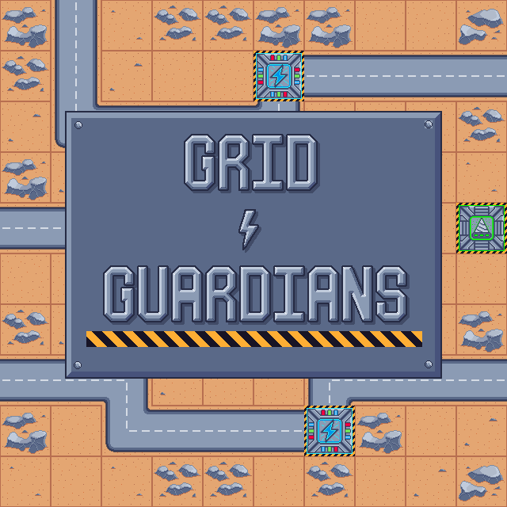

# Grid Guardians [(link)](https://spiralforgestudio.itch.io/grid-guardians)
*"In the era of space exploration, mega corporations venture out to explore new worlds and gather resources to feed the ever-growing appetite of humanity. These corporations clash in alien landscapes in order to compete for resource-rich sectors. You are one of many paramilitary engineers hired by SkrapTek™ tasked with defending their sectors against other corporations. Go forth and defend the grid!"*

  

Grid Guardians is a top-down tower defense game featuring real-time strategy resource management in a 2D pixel art style. The game revolves around effectively managing your resources through **Mining Nodes** and **Power Nodes** to fund and power your towers. You fight through waves of assorted ground and flying enemies on various levels using tactically placed towers that suit the needs of your defense strategy. 

## Game Features
### Towers
- **B4-L1-sT4 Autocannon:** Ground targets only. Large bore, full-auto, plasma cannon. Good for tougher enemies.
- **Tr-1PL3 SAM Site:** Air targets only. An Explosive Surface-to-Air Missile system that can take out swarms of flying enemies.
- **BG-Z4Pr Tesla Coil:** [*BUGGED! Don't use!*] Experimental air and ground targeting hybrid towers that can a hit a limited number of enemies. Good all-arounder for intersections of air and ground enemy lanes
- **SH-4K3r Earthquake Tower:** Ground targets only—a large shockwave generator. Originally used for mining, it has now been repurposed for striking hordes of ground targets.
### Enemies
- **Grunt:** Your basic robotic grunt. Moves at a medium pace. The bread and butter of any hoard.
- **Fast Grunt:** Kachow. The fastest and most brittle land enemy. Zooms past most blockades and structures.
- **Heavy Spinner:** Here it comes! The slow but steady juggernaut of the land enemies. Deals significant damage to any power node in its path.
- **Basic Flyer:** Your basic aerial grunt. Moves at a medium-fast pace. Prioritizes resource nodes, particularly mining nodes. 
- **Gunship Flyer:** Call an Airstrike. The slow but deadly aerial enemy, although it can take a lot of hits. 

## Release Information
- Entry for the [Summer Slow Jams 2024: Resource Management](https://itch.io/jam/ssjresourcemanagement).
- Published on Jun 25, 2024, on the itch.io platform.

## Contributors
- KinXslayer
  - Game Design
  - Pixel Art
  - UI design
  - Sound Design
- mrmedrano81
  - Programming
  - Sound Design
- Ellipsis-sudo
  - Programming
